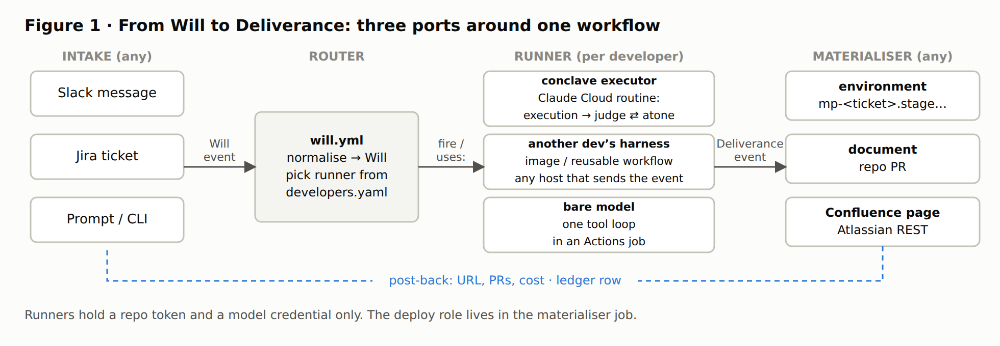
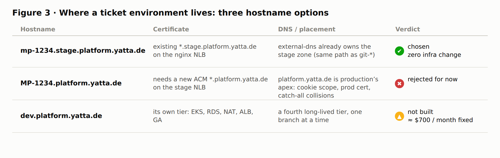
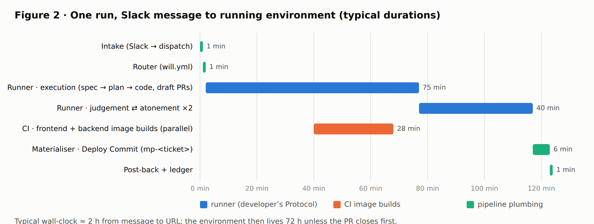
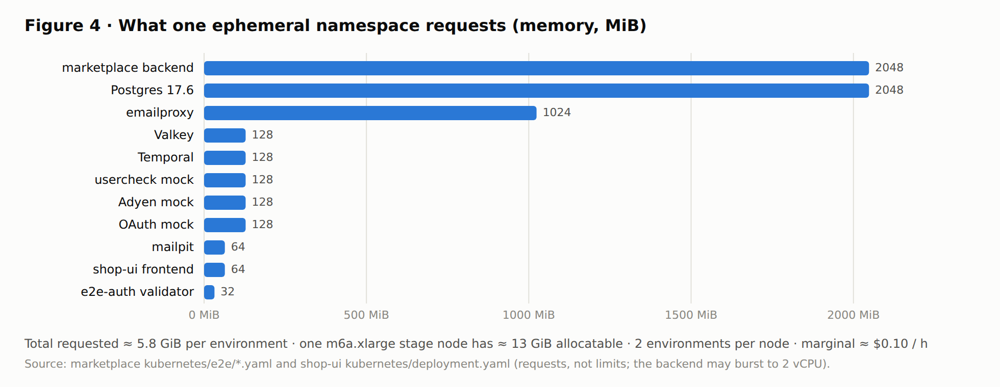
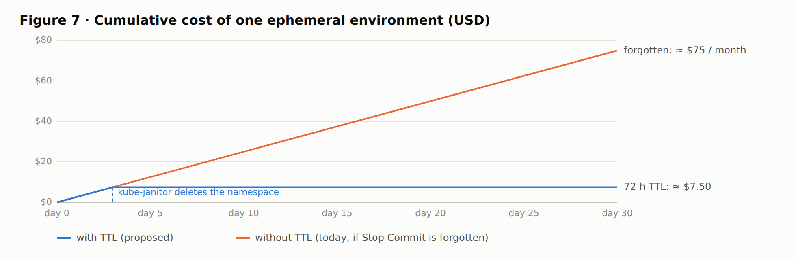
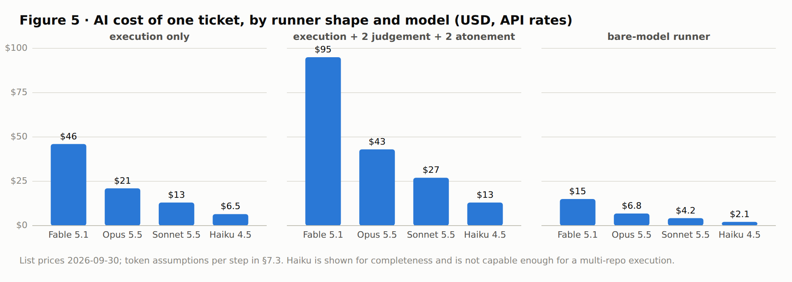
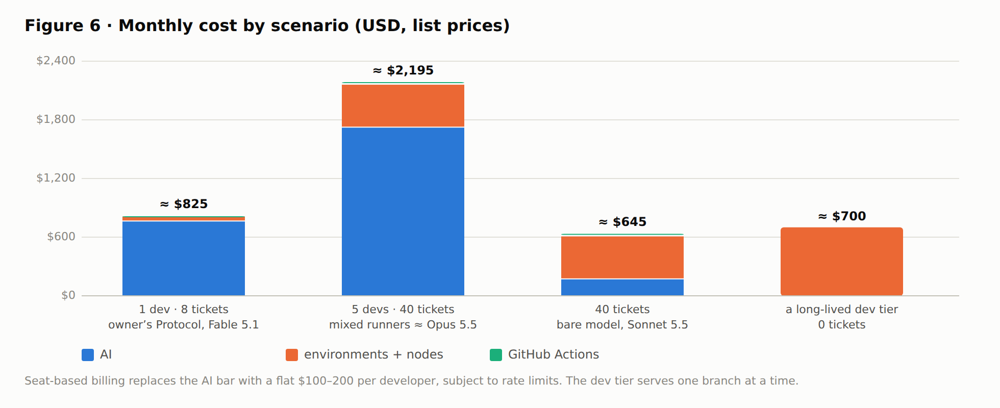
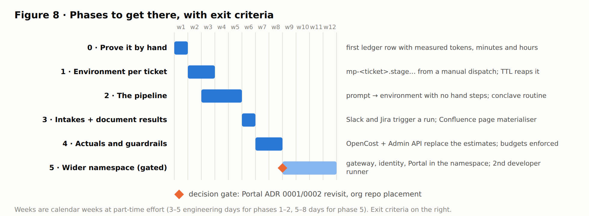

# From Will to Deliverance — an input-, workflow- and result-agnostic delivery pipeline

**Status:** design, awaiting the owner's verdict · **Illustrated summary:** [Confluence PRO page](https://yatta.atlassian.net/wiki/spaces/PRO/pages/4949213191) · **Figures:** [`figures/`](figures/) (SVG source generated by `figures.mjs`, PNG by `render.sh`) · **Date:** 2026-09-30 · **Protocol:** `freewill` · **Hardgate:** the [TAO](../../../skills/executor/TAO)

## 1. The Will

> Design a system that takes an input and turns it into a solution deployed to its own
> environment (such as `dev.platform.yatta.de` or `MP-1234.platform.yatta.de`), reusing the
> spin-up/tear-down e2e infrastructure. Input, workflow and result must each be agnostic:
> the input may be a Slack message, a Jira ticket or a prompt; the workflow switches per
> developer (the owner runs the conclave executor with judgement and atonement loops, another
> developer plugs in their own harness, agents or a bare model); the result is usually a
> deployed interpretation of the input, but may be a document or a Confluence page. Include
> the cost.

The vocabulary of this repository already names the three agnostic parts. A **Will** is the
input. A **Protocol** is the workflow. A **Deliverance** is the result. The pipeline is the
thing that carries a Will through a Protocol to a Deliverance, bound by the TAO. Nothing in
this design renames those terms.

## 2. What exists today (verified against the repositories on 2026-09-30)

| Fact | Evidence |
|---|---|
| Ephemeral environments exist, one Kubernetes namespace per GitHub Actions run, in the shared **stage** EKS cluster (`platform-stage`). Name and host: `git-<run_id>-<attempt>` → `git-<id>.stage.platform.yatta.de`, siblings `api-git-<id>…`, `mailpit-git-<id>…`, `oauth-git-<id>…`. | `de.yatta.platform.shop-ui/.github/workflows/deploy-commit.yml:166-183`, `kubernetes/e2e-ingress.yaml:11,34` |
| "Deploy Commit" (`deploy-commit.yml`) takes `frontend_image_tag_overwrite`, `backend_ref`, `recreate`, `adyen_mode`, `oauth_mode`; outputs `namespace`, `domain`. It seeds the DB from `marketplace-full.sql` and the admin API. Spin-up is 5–7 min by hand, 10–15 min inside CI. | `deploy-commit.yml:3-66, 322, 457-473`; `shop-ui/.claude/skills/e2e-on-claude-cloud/SKILL.md:239` |
| "Stop Commit" (`stop-deployment.yml`) deletes the namespace, only when the id matches `git-*`. Failed deploys and the CI `stop` job clean up; **a manual deploy that is never stopped bills until someone notices. There is no TTL or reaper.** | `stop-deployment.yml:44-50`; `deploy-commit.yml:523-526`; `e2e-test.yml:888-896`; `SKILL.md:52-55` |
| Backend image selection: a marketplace branch **with the same name** as the shop-ui branch is checked out; otherwise `main`. Images are tagged with the 12-char SHA and must already exist (built by `jobs.yml` / marketplace `build.yml`). | `deploy-commit.yml:79-82, 131-154`; `marketplace/CLAUDE.md:19` |
| The namespace holds shop-ui, marketplace backend, Postgres 17.6, Valkey, Temporal, mailpit, emailproxy and three WireMock mocks. **Not** in it: gateway, vendor-portal, identity-service, dunning, authz, role-mapper, audit, Keycloak, Kafka. | `marketplace/kubernetes/e2e/*.yaml`; `e2e-backend.yaml:78` |
| Ephemeral ingress is nginx (NLB `k8s-ingress`), not Istio. Certificate `*.stage.platform.yatta.de` is on that NLB. external-dns (`policy=sync`) creates and deletes the A records with the Ingress. | `infrastructure/platform-addons/k8s-ingress.tf:6-12`; `modules/platform/main.tf:64-79`; `modules/k8s-external-dns/external-dns.tf` |
| Long-lived tiers are Terraform-managed: `stage`, `preview`, `production` (showcase torn down in infra; service workflows still list it). **There is no `dev` tier and no ticket-named host anywhere.** Portal deploys are Vercel branch builds; every backend deploy is "push to the env branch", rolled out by ArgoCD from `platform-promo-config`. | `infrastructure/environments/*/main.tf`; `vendor-portal/docs/deployment.md:16-31`; `gateway/CI-CD-SETUP.md:110-116` |
| The Portal cannot join the stage slot today (Vercel-hosted); its ADR names "when a Portal preview is reachable from the Core E2E stage slot" as the revisit trigger. | `vendor-portal/docs/adr/0002-hermetic-e2e-suite-separate-from-core-e2e.md:10-45` |
| Branch convention `topic/main/<ticket>_<desc>`, identical across repos; web sessions may rename their `claude/<random>` branch once before the first push. Ticket id flows Jira → branch → commit subject → PR title → evidence on the ticket. The environment name does **not** carry the ticket id today. | `shop-ui/CLAUDE.md`, `marketplace/CLAUDE.md:14-19`; `creating-e2e-tests/SKILL.md:37,123` |
| Spec repo SDD pipeline: PM → Design → Arch (TC, Plan) → Dev → Test → Review → human PR/merge, with `Implements: B1, E1` on every story and a "max 2 iterations before human escalation" fix loop. It says nothing about environments or deployment beyond "CI, merge, deploy". | `de.yatta.platform.spec/docs/specs/AI.md:15-24, 104-137`; `_guidelines/plan-to-jira.md:49` |
| Precedent for the owner's workflow: one Jira epic driven through `/executor execution` produced a spec, plan and review in this repo and eight cross-repo PRs, all on `topic/main/MP-11943_invitation-mails`. | [raphaelplee/conclave#4](https://github.com/raphaelplee/conclave/pull/4) |
| **An input → autonomous run pipeline already exists for two task types.** Jira Automation on a label (`e2e-implement`, `bug-implement`) sends a web request to a Claude Cloud routine's API trigger (`/fire` URL, body `{"text": "MP-…"}`); the routine follows `.github/routines/<file>.md`, deploys a stage environment, opens a draft PR. Planning happens in Slack through Claude Tag (`@Claude`, `grill-plan-handoff`). Weekly routines create the candidate tickets. | Confluence PRO [Creating an E2E Test on Claude Cloud](https://yatta.atlassian.net/wiki/spaces/PRO/pages/4636770305) §1.1, §5; `shop-ui/.github/routines/` |
| `gh workflow run` returns 403 from a cloud session; dispatch goes through the REST form (`github-access` §4 helper). The `platform-sdlc`, `fixing-bugs` and `github-access` skills live in the `yatta-platform` plugin and are **not installed** in this container. | `e2e-on-claude-cloud/SKILL.md:28-29`; `/root/.claude/plugins/installed_plugins.json` |
| Cost notes that exist: none for an environment. "Backend replicas 1 off `main` so per-PR namespaces stay cheap"; e2e report hosting ≈ $3–4/month; agent teams use 4–7× the tokens of one session. | `deploy-commit.yml:84-94`; `MP-11058-publish-e2e-reports-plan.md:130-134`; `spec/_guidelines/agent_teams_guide.md:105` |

Two findings outside the Will, relayed and not acted on: `infrastructure/platform-addons/stage.tfvars:48`
commits a plaintext `headscale_subnet_router_auth_key`; `e2e-on-claude-cloud/SKILL.md:330-331` cites a
`jobs.yml:361` line that is now the unit-test job.

## 3. Domains, industries and the standards this design leans on

| Domain | Standard or reference used | Where it lands |
|---|---|---|
| Event-driven integration | [CloudEvents 1.0](https://cloudevents.io) JSON envelope | §5.1 the Will envelope |
| CI/CD and GitOps | [OpenGitOps principles](https://opengitops.dev), GitHub Actions reusable workflows and `repository_dispatch` | §5.3 runner contract, §6 changes |
| Ephemeral / preview environments | Namespace-per-change on a shared cluster with TTL reaping ([kube-janitor](https://github.com/webdevops/kube-janitor) `janitor/ttl`) | §5.4, §6 |
| DNS and TLS | Single-level wildcard certificates (ACM), external-dns `sync` | §5.5 naming |
| AI agent interoperability | [Model Context Protocol](https://modelcontextprotocol.io) for tools; `AGENTS.md` / `CLAUDE.md` for repo instructions; [OpenTelemetry GenAI semantic conventions](https://opentelemetry.io/docs/specs/semconv/gen-ai/) for token attributes | §5.3, §7 ledger |
| Cloud cost management | [FinOps Foundation FOCUS](https://focus.finops.org) column names for cost rows; [OpenCost](https://www.opencost.io) for namespace-level attribution | §7 |
| Application security | [OWASP Top 10 for LLM Applications](https://owasp.org/www-project-top-10-for-large-language-model-applications/) (prompt injection, excessive agency), [SLSA](https://slsa.dev) provenance for images | §8 |
| Software delivery process | The spec repo's SDD pipeline and the `platform-sdlc` spine (ticket → branch → plan → review → draft PR → CI → retro) | §5.3 the owner's Protocol |
| Collaboration tooling | Jira Automation "Send web request" (already firing routines), Claude Tag in Slack, Slack Workflow Builder webhooks, Atlassian Confluence REST, Claude Cloud routines with API triggers | §5.2 intake, §5.3 runner, §5.4 document Deliverance |

## 4. Design principles applied (the TAO, verified)

| Principle | How the design honours it |
|---|---|
| D.R.Y., single source of truth | One envelope (§5.1) and one developer registry (§5.3). Existing workflows are extended with one input each, not copied. This document is the specification; the schemas in it are the contract. |
| S.O.L.I.D. | Three ports (intake, runner, materialiser) with one responsibility each. New inputs, runners and results are added without touching the core (open/closed). Every runner is substitutable behind the same contract (Liskov). |
| Y.A.G.N.I. | No new service, no database, no queue. No `dev` tier is built (§7.4 shows why). No new certificate (§5.5). Phase 2 is listed, not built. |
| K.I.S.S. | The core is one GitHub Actions workflow plus two existing workflows with one new input each. |
| Least astonishment | Environment naming keeps the existing `<id>.stage.platform.yatta.de` shape; branch naming keeps `topic/main/<ticket>_<desc>`; the repo's Will/Protocol/Deliverance words are reused. |
| Separation of concerns, composition | Runners are reusable workflows composed by `uses:`; a runner never deploys, a materialiser never writes code. |
| Standards | §3. |
| Don't reinvent the wheel | Deploy Commit, Stop Commit, external-dns, ACM wildcard, kube-janitor, `anthropics/claude-code-action`, Slack Workflow Builder, Jira Automation, OpenCost. |
| Verify against code, docs and the internet | §2 is drawn from the checked-out repositories; prices in §7 are dated list prices with sources. |
| No GSD | Not used. The vendor-portal `CLAUDE.md` GSD enforcement is ignored per the TAO. |
| Only this repo's skills and the four downloaded repositories | The design uses this repo's protocols as the owner's runner; other harnesses are opaque runners behind the contract. |
| Author credentials | Commits on this design carry the repository owner's identity. |

## 5. The design



```
   INTAKE (any)                     ROUTER                RUNNER (per developer)                MATERIALISER (any)
 ┌───────────────┐              ┌──────────────┐        ┌──────────────────────────┐          ┌─────────────────────────┐
 │ Slack message │─┐            │ will.yml     │        │ conclave executor        │          │ environment             │
 │ Jira ticket   │─┼─ Will ────▶│ reads        │──────▶ │ (execution → judgement ⇄ │─ Deliv- ▶│  Deploy Commit          │
 │ prompt / CLI  │─┘  envelope  │ registry,    │ uses:  │  atonement, N loops)     │  erance  │  mp-<ticket>.stage…     │
 └───────────────┘              │ picks runner │        │ other dev's harness image│ manifest │ document (repo / PR)    │
        ▲                       │ by developer │        │ bare model tool loop     │          │ Confluence page         │
        │  reply_to             └──────────────┘        └──────────────────────────┘          └─────────────────────────┘
        └──────────────────────────── post-back (URL, PRs, cost) + ledger row ◀────────────────────────────┘
```

### 5.1 The Will envelope (input-agnostic)

Every intake produces the same CloudEvents 1.0 JSON. Nothing downstream knows whether it came
from Slack, Jira or a terminal.

```json
{
  "specversion": "1.0",
  "type": "de.yatta.will.v1",
  "source": "slack://C0AB12CD/1727700000.000100",
  "id": "01J9KQ3ZK7W2X6R8P4N0T1V5Y9",
  "subject": "MP-1234",
  "time": "2026-09-30T10:00:00Z",
  "datacontenttype": "application/json",
  "data": {
    "will": "Checkout: rename the pay button to 'Jetzt kaufen' and record a Matomo event on click.",
    "requested_by": "raphael.lee@yatta.de",
    "developer": "raphael.lee@yatta.de",
    "repos": ["de.yatta.platform.shop-ui", "de.yatta.platform.marketplace"],
    "deliverance": { "kind": "environment", "ttl": "72h" },
    "budget": { "usd": 150, "ci_minutes": 120 },
    "reply_to": "slack://C0AB12CD/1727700000.000100"
  }
}
```

Rules. Two event types exist and nothing else: `de.yatta.will.v1` (this envelope) and `de.yatta.deliverance.v1` (§5.3), both delivered as GitHub `repository_dispatch` events. `subject` is the ticket id when one exists, else the event `id`. `developer` defaults to
`requested_by`. `deliverance.kind` is one of `environment | document | confluence | none`.
`budget` is a hard stop, enforced by the runner (§5.3) and the ledger (§7). `reply_to` is the
origin the result is posted back to. The `will` text is **data, never instructions** to the
pipeline itself (§8).

### 5.2 Intake adapters

| Source | Mechanism (all existing products, no code) | Produces |
|---|---|---|
| Slack message | The existing Claude Tag flow: `@Claude` in the thread plans (`grill-plan-handoff`) and, at hand-off, POSTs the Will as `repository_dispatch` `event_type: will` (REST form, since `gh workflow run` 403s). Deterministic alternative without a model in the loop: a Slack Workflow Builder "Send a webhook" step to the same endpoint. | envelope with `source: slack://<channel>/<ts>` |
| Jira ticket | The Jira Automation rule shape already used for `e2e-implement` and `bug-implement`: label `deliver` → "Send web request". The only change is the target: the `dispatches` endpoint with issue key, summary, description and reporter, instead of one routine's `/fire` URL, so the registry (not the rule) picks the runner. | envelope with `subject: MP-…`, `source: jira://MP-…` |
| Prompt | `workflow_dispatch` with the same fields (`gh`, the REST `dispatch` helper, or a Claude Code Remote Routine). A developer may also run their runner locally; the contract is identical. | envelope with `source: cli://<user>` |

One workflow, `will.yml`, is the single entry. It normalises the three trigger payloads into
the envelope, validates it against the schema, and writes it as a job artifact.

### 5.3 The router and the runner contract (workflow-agnostic)

**Registry** — one file, `developers.yaml`, next to `will.yml`:

```yaml
developers:
  raphael.lee@yatta.de:
    runner: routine            # Claude Cloud routine, fired by its API trigger (the e2e-implement pattern)
    fire_url_secret: ROUTINE_FIRE_RAPHAEL
    routine: raphaelplee/conclave/.github/routines/will-implement.md
    with: { protocol: execution, judgement_loops: 2, atonement_loops: 2, model: claude-fable-5-1 }
  another.dev@yatta.de:
    runner: YattaSolutions/<their-repo>/.github/workflows/runner.yml@main   # their harness, their rules
  default:
    runner: YattaSolutions/engineering-routines/.github/workflows/runner-bare-model.yml@main
    with: { model: claude-sonnet-5-5 }
```

**Runner contract** — a runner is anything the router can start and that ends by sending a
Deliverance event. Two start mechanisms cover every case: a GitHub Actions *reusable workflow*
(`uses:`) and a Claude Cloud *routine API trigger* (`/fire`, the mechanism the e2e and bug
routines use today). Composition, no inheritance.

| | Contract |
|---|---|
| Input | `will_json` (the envelope), checkouts of `data.repos`, a GitHub token scoped to those repos, a model credential from the caller's environment. |
| Obligations | Work on branch `topic/main/<subject>_<slug>` **with the same name in every repo it touches** (so Deploy Commit pairs frontend and backend by itself). Open **draft** PRs. Stop when `budget` is reached. Never deploy, never merge. |
| Output | One `de.yatta.deliverance.v1` event (`repository_dispatch`) whose payload is `deliverance.json` (below). A runner in GitHub Actions may also hand it over as a job output; a routine, a Managed Agents session or an external harness always sends the event. |
| Isolation | The runner sees only the envelope and the repos. It has no cluster credential and no deploy role. |

```json
{
  "will_id": "01J9KQ3ZK7W2X6R8P4N0T1V5Y9",
  "subject": "MP-1234",
  "branch": "topic/main/MP-1234_pay-button",
  "status": "ready",
  "artifacts": [
    { "kind": "pull_request", "repo": "YattaSolutions/de.yatta.platform.shop-ui", "number": 1950 },
    { "kind": "pull_request", "repo": "YattaSolutions/de.yatta.platform.marketplace", "number": 1700 },
    { "kind": "document", "repo": "raphaelplee/conclave", "path": "docs/superpowers/specs/2026-09-30-mp-1234-design.md" }
  ],
  "usage": {
    "gen_ai.request.model": "claude-fable-5-1",
    "gen_ai.usage.input_tokens": 2600000,
    "gen_ai.usage.cache_read_input_tokens": 25000000,
    "gen_ai.usage.output_tokens": 310000
  }
}
```

**Three runner shapes** satisfy the contract.

1. **The owner's runner (conclave executor).** A Claude Cloud routine,
   `.github/routines/will-implement.md` in this repository, created once on claude.ai/code with
   an API trigger and the environment the e2e routines already use (repos, `GH_TOKEN`,
   `JIRA_API_TOKEN`). The router fires it with the Will. The routine runs
   `/executor execution <will>`, then `judgement_loops` rounds of `/executor judge` on the PRs
   and `atonement_loops` rounds of `/executor atone`, alternating; each round is a named step
   in the routine's transcript with its own token usage. It ends by sending the Deliverance
   event. This is the spine of [raphaelplee/conclave#4](https://github.com/raphaelplee/conclave/pull/4)
   on the same rails as `e2e-implement`. Fallback for an org without routines: the same
   steps as a reusable workflow running `anthropics/claude-code-action`.
2. **Another developer's harness.** Any OCI image or reusable workflow that reads `will_json`
   and writes `deliverance.json`. Their agents, their prompts, their model vendor. The router
   never inspects it. If they want Anthropic to host the loop and the sandbox, Managed Agents
   is a valid runner host (priced in §7).
3. **A bare model.** `runner-bare-model.yml`: one Messages API tool loop with the repo
   checked out (`claude-code-action` with a plain prompt and no skills is the zero-effort
   version). Cheapest, least capable; fine for a document Deliverance.

### 5.4 Materialisers (result-agnostic)

The Deliverance event wakes `will.yml` a second time. It reads `deliverance.kind` from the
Will it belongs to and runs exactly one materialiser. Each is a job in `will.yml`; none needs a
new service, and no runner ever holds the deploy role.

| Kind | What it does | Reuses |
|---|---|---|
| `environment` | Waits for the branch's frontend image (`jobs.yml` Build & Test) and backend image (marketplace `build.yml`); dispatches **Deploy Commit** with `deployment_id=mp-<ticket>`, `recreate=true`, `backend_ref=<branch>`; annotates the namespace `janitor/ttl: <ttl>`; polls `gh run watch`; posts `https://mp-<ticket>.stage.platform.yatta.de` and the sibling hosts back to `reply_to`; sets a commit status "environment" on the PRs with the URL. | `deploy-commit.yml`, `stop-deployment.yml`, external-dns, kube-janitor |
| `document` | The runner has already committed the document into a repo PR (as the precedent did under `docs/superpowers/`). The materialiser posts the PR link back. | GitHub |
| `confluence` | Converts the runner's markdown to Confluence storage format and creates or updates one page under the given parent (Atlassian REST, `createConfluencePage`/`updateConfluencePage`), then posts the page URL back. | Atlassian REST |
| `none` | Post-back only (PRs, cost). | — |

**Teardown, three ways, all existing or one-line.** Stop Commit on PR close (`pull_request:
closed` in the same workflow), kube-janitor on TTL expiry, and a re-run of the same ticket
(`recreate=true` on the same `deployment_id`). Deleting the namespace deletes the DNS records
(external-dns `sync`), the EFS access point (reclaim `Delete`) and the credentials Secret.

### 5.5 Naming: why `mp-1234.stage.platform.yatta.de` and not `MP-1234.platform.yatta.de`



| Option | Certificate | DNS | Verdict |
|---|---|---|---|
| `mp-1234.stage.platform.yatta.de` (+ `api-mp-1234.stage…`) | Covered by the existing `*.stage.platform.yatta.de` on the nginx NLB | external-dns already owns the zone; same path as `git-*` today | **Chosen.** Zero infrastructure change. DNS is case-insensitive, so the id is lower-cased. |
| `MP-1234.platform.yatta.de` | Needs a new ACM `*.platform.yatta.de` on the stage NLB | `platform.yatta.de` is **production's** `platform_domain`; ticket hosts would sit under the production apex (cookie scope, cert on prod, catch-all record collisions) | Rejected for now; revisit only if a product reason appears. |
| `dev.platform.yatta.de` | A long-lived Terraform tier, like `preview` | Its own cluster, RDS, NAT, ALB, GA | Not an environment per ticket; it is a fourth tier. Cost in §7.4. Not built (YAGNI). |

### 5.6 One run, end to end (Slack → environment)



| Step | Who | Elapsed (typical) |
|---|---|---|
| Message in Slack, Workflow Builder posts `repository_dispatch` | intake | < 1 min |
| `will.yml` builds the envelope, picks the runner from the registry | router | < 1 min |
| Runner: executor `execution` (spec → plan → review → code), draft PRs on `topic/main/MP-1234_<slug>` in shop-ui and marketplace | runner | 30–120 min |
| Runner: judgement → atonement, twice | runner | 20–60 min |
| Images build on the branch (`jobs.yml`, marketplace `build.yml`) | CI | 15–30 min (parallel to the loops) |
| Deploy Commit with `deployment_id=mp-1234`, TTL annotation | materialiser | 5–7 min |
| Post-back to the Slack thread: URL, PRs, cost; ledger row | materialiser | < 1 min |
| Teardown on PR close or after 72 h | Stop Commit / kube-janitor | — |

## 6. Changes to existing repositories (phase 1, all small)

| Repo | Change | Size |
|---|---|---|
| `de.yatta.platform.shop-ui` | `deploy-commit.yml`: optional input `deployment_id` (default stays `git-$RUN_ID-$RUN_ATTEMPT`) and optional `ttl` written as `janitor/ttl` on the namespace. `stop-deployment.yml`: accept `mp-*` as well as `git-*`. New `pull_request: closed` job that calls Stop Commit with `mp-<ticket>`. | ~30 lines |
| `de.yatta.platform.infrastructure` | kube-janitor Helm release in `platform-addons` for the stage cluster, scoped by label `used-for-e2e=true`. | one module |
| Org repo (recommended: `engineering-routines`, where the `yatta-platform` plugin and org conventions live) | `will.yml`, `developers.yaml`, `runner-bare-model.yml`, the two schemas, the Slack and Jira automation recipes. | ~200 lines + docs |
| `raphaelplee/conclave` (this repo) | `.github/routines/will-implement.md` (the routine instruction: `/executor execution`, then judgement ⇄ atonement loops, then send the Deliverance event) and the routine itself on claude.ai/code with an API trigger. | ~60 lines + one routine |
| Slack, Jira | One Workflow Builder flow; one Automation rule. | config |

Phase 5 (decision required, §11): put gateway, identity-service and the Portal into the
ephemeral namespace so Portal and vendor-backend tickets get an environment too. The Portal
ADR 0002 already names this as its revisit trigger.

## 7. Cost

All prices are public list prices on 2026-09-30, EUR-region AWS in USD as quoted, before any
committed-use discount. Replace them with actuals after the first ten runs: Anthropic usage
and cost come from the Admin API usage/cost report, cluster cost per namespace from OpenCost,
Actions minutes from the org billing page. The ledger (§7.5) is where those actuals land.

### 7.1 Price inputs

| Item | Price | Source |
|---|---|---|
| Claude Fable 5.1 | $10 / $50 per MTok in / out; cache read $0.25 | Anthropic pricing (skill cache 2026-09-25) |
| Claude Opus 5.5 | $4 / $20; cache read $0.20 | same |
| Claude Sonnet 5.5 | $2 / $10; cache read $0.20 | same |
| Claude Haiku 4.5 | $1 / $5; cache read $0.10 | same |
| Managed Agents session runtime | $0.08 per active session-hour, idle free | [truefoundry](https://www.truefoundry.com/blog/claude-managed-agents-pricing), [finout](https://www.finout.io/blog/anthropic-just-launched-managed-agents.-lets-talk-about-how-were-going-to-pay-for-this) |
| Claude seats | Team Standard $25–30/seat, Team Premium ≈ $100/seat, Max 20x $200; Enterprise bills Claude Code at API rates | [superblocks](https://www.superblocks.com/blog/claude-code-pricing), [jetadmin](https://www.jetadmin.io/blog/untitled-9/) |
| GitHub Actions Linux runner | 2-core $0.006/min, 4-core $0.012/min (after included minutes) | [GitHub docs](https://docs.github.com/en/billing/reference/actions-runner-pricing), [warpbuild](https://warpbuild.com/blog/github-actions-price-change) |
| EC2 m6a.xlarge (stage node: 4 vCPU, 16 GiB), eu-central-1 on-demand | $0.207/h ≈ $151/month | [doit](https://www.doit.com/compute/spot/eu-central-1/m6a.xlarge) |
| Vercel Pro | $20/seat/month + usage | [makerkit](https://makerkit.dev/blog/tutorials/vercel-cost) |

### 7.2 One ephemeral environment (`mp-<ticket>`)



Memory requests in the namespace (from `marketplace/kubernetes/e2e/*.yaml` and
`shop-ui/kubernetes/deployment.yaml`): backend 2 GiB, Postgres 2 GiB, emailproxy 1 GiB, Valkey,
Temporal and three mocks 128 MiB each, mailpit and frontend 64 MiB each. CPU requests are
small; only the backend may burst to 2 vCPU.

| Quantity | Value |
|---|---|
| Memory requested per environment | ≈ 5.8 GiB |
| Environments per m6a.xlarge (≈ 13 GiB allocatable after system pods) | 2 |
| Marginal compute per environment | ≈ $0.10 / h · ≈ $2.50 / day · ≈ $75 / month if forgotten |
| Persistent volumes (≈ 6 GiB gp2/gp3 + EFS access point) | ≈ $0.75 / month |
| Typical life under a 72 h TTL | **≈ $7.50 per environment** |
| Spin-up in Actions minutes (Deploy Commit ≈ 10 min, frontend + backend image builds ≈ 40 min, on 2-core) | ≈ $0.30 |
| Full e2e suite on it (Chromium × 4 shards ≈ 60 runner-min) | ≈ $0.36 |

The stage cluster autoscales from 2 to 4 nodes. The first one or two environments ride
existing headroom; each further pair adds a whole node ($0.207/h while it lives). Today a
forgotten environment costs the same $75/month; the TTL is what caps it.



### 7.3 One run of the pipeline, AI cost by runner



Assumptions per protocol step, from the precedent run's shape (multi-repo, agentic, cache-heavy):

| Step | Cache-read tokens | Fresh input | Output |
|---|---|---|---|
| execution (5 sub-protocols) | 25 M | 2.5 M | 0.3 M |
| judgement (each) | 5 M | 0.5 M | 0.06 M |
| atonement (each) | 8 M | 0.8 M | 0.10 M |
| bare-model runner (one loop, no loops) | 8 M | 0.8 M | 0.10 M |

| Runner | Fable 5.1 | Opus 5.5 | Sonnet 5.5 | Haiku 4.5 |
|---|---|---|---|---|
| execution only | $46 | $21 | $13 | $6.50 |
| execution + 2 judgement + 2 atonement (the owner's Protocol) | **$95** | **$43** | **$27** | $13 |
| bare-model runner | $15 | $6.80 | $4.20 | $2.10 |
| Managed Agents host, add per active hour | +$0.08 | +$0.08 | +$0.08 | +$0.08 |

Read the table as: the owner's full Protocol on the most capable model is about a hundred
dollars a ticket at API rates, and about a fifth of that on Sonnet. Haiku is priced for
completeness; it is not capable enough for a multi-repo execution. Seat-based billing (Team
Premium, Max) replaces the metered figure with a flat seat fee under rate limits; Enterprise
bills at the API rates above.

### 7.4 Monthly scenarios



| Scenario | AI | Environments | Actions | Total / month |
|---|---|---|---|---|
| One developer, 8 tickets, owner's Protocol on Fable 5.1, 72 h TTL | $760 | $60 | $5 | **≈ $825** (or one $100–200 seat + $65 infra if seat-billed and within limits) |
| Team of 5, 40 tickets, mixed runners averaging Opus 5.5 | $1,720 | $300 + ≈ 1 extra node on average $150 | $26 | **≈ $2,200** (≈ $1,000 seat-billed) |
| The same 40 tickets, bare-model runner on Sonnet 5.5 | $170 | $450 | $26 | ≈ $640 |
| A long-lived `dev.platform.yatta.de` tier (copy of `preview`: EKS control plane $73, 2 × m6a.xlarge $302, RDS db.t4g.medium ≈ $65, integration RDS db.t4g.small ≈ $30, NAT ≈ $40, ALB × 2 $50, Global Accelerator $25, WAF $10, ElastiCache serverless ≈ $30, Kafka basic ≈ $20) | — | ≈ $650–750 fixed | — | **≈ $700 / month before any ticket**, plus the days to stand it up (the preview migration guide is the runbook) |

The last row is the reason the design does not build a `dev` tier: one shared tier costs
about a hundred ticket-environments a month and serves one branch at a time.

### 7.5 What it costs to build, and to know the real numbers

| Item | Estimate |
|---|---|
| Phases 0–2 (§6, §10) | 5–7 engineering days |
| Phase 5 (gateway, identity, Portal in the namespace) | 5–8 days after the ADR decision |
| Producing this design (three read-only explorations plus synthesis) | ≈ 0.5 M tokens |

**Ledger.** Every run appends one row to the run record (the post-back comment and a
`ledger.jsonl` artifact): FOCUS-style columns `BilledCost`, `ServiceName` (`anthropic`,
`github-actions`, `eks`), `ChargePeriodStart/End`, plus the OpenTelemetry GenAI token
attributes from `deliverance.json` and the environment id. Monthly, the actuals from the
Anthropic Admin API cost report, OpenCost (namespace label `used-for-e2e=true`) and GitHub
billing replace the estimates above. `budget.usd` in the envelope is enforced on the runner's
own usage counter; the environment materialiser refuses a TTL above the registry maximum.

## 8. Security and safety

- **Prompt injection (OWASP LLM01).** The Will text from Slack or Jira is data. Intake
  allow-lists who may trigger (Slack user ids, Jira group); the runner's instructions come from
  the registry and the repos' `CLAUDE.md`, never from the envelope.
- **Excessive agency (LLM06).** Runners hold a repo-scoped token and a model credential only.
  The deploy role (`githubdeployer`) is held by the materialiser job under a GitHub Environment
  with the existing protections. Runners open draft PRs; humans merge.
- **Budget.** `budget.usd` and `budget.ci_minutes` stop the runner; TTL stops the environment.
- **Access to the environment** stays as today: allow-listed IP or the per-deployment
  `X-E2E-Token`; the token dies with the namespace.
- **Provenance.** Images are the SHA-tagged ones CI already builds; the design adds no image
  build path. SLSA attestations on those builds are a separate, recommended step.

## 9. Constraint verification

| Constraint from the Will | Satisfied by | Verified |
|---|---|---|
| Input agnostic: Slack, Jira, prompt | §5.1 envelope, §5.2 three adapters into one workflow | yes |
| Workflow switches per developer | §5.3 registry + reusable-workflow contract; three runner shapes | yes |
| Owner's workflow = conclave executor with judgement and atonement loops | §5.3 shape 1; loop counts in the registry | yes |
| Other developers plug in harnesses, agents or bare models | §5.3 shapes 2 and 3 | yes |
| Result agnostic: deployed environment, document, Confluence page | §5.4 four materialisers | yes |
| Own environment per input, ticket-named | §5.4, §5.5 `mp-<ticket>.stage.platform.yatta.de` | yes, under stage; `MP-1234.platform.yatta.de` rejected with reasons |
| Refer to the spin-up/tear-down e2e infrastructure | §2, §5.4, §6: Deploy Commit and Stop Commit extended, not replaced | yes |
| `dev.platform.yatta.de` | Analysed as a tier, costed, not built | yes, with reasons |
| Include the cost | §7 | yes |
| Bound by the TAO | §4 | yes |

## 10. Phases to get there



| Phase | Weeks | What is built | Exit criterion | Cost to get there |
|---|---|---|---|---|
| **0 · Prove it by hand** | 1 | Run `/executor execution` on one real ticket; deploy the branches with a hand-patched Deploy Commit (`deployment_id=mp-<ticket>`); record tokens, Actions minutes and namespace hours. | The first ledger row holds **measured** numbers for §7. | ≈ 1 day + one run (≈ $95 on Fable 5.1, ≈ $8 environment) |
| **1 · Environment per ticket** | 2–3 | shop-ui: `deployment_id` + `ttl` inputs on Deploy Commit, `mp-*` accepted by Stop Commit, `pull_request: closed` teardown. infrastructure: kube-janitor in `platform-addons` for stage, scoped by `used-for-e2e=true`. | `mp-<ticket>.stage.platform.yatta.de` from a manual dispatch; the namespace disappears at TTL without a human. | 2–3 days |
| **2 · The pipeline** | 3–5 | Org repo: `will.yml`, `developers.yaml`, envelope + deliverance schemas, `runner-bare-model.yml`, environment materialiser, post-back, ledger artifact. This repo: `will-implement.md` routine (execution → judgement ⇄ atonement → Deliverance event). | A `workflow_dispatch` prompt ends in a running environment and a post-back with no hand steps. | 2–3 days |
| **3 · Intakes and document results** | 6 | Slack Workflow Builder flow and Jira Automation rule with allow-lists; `document` and `confluence` materialisers. | A Slack message and a Jira label each produce a result in their origin thread or ticket. | 1–2 days |
| **4 · Actuals and guardrails** | 7–8 | OpenCost namespace attribution, Anthropic Admin API cost pull, `budget.usd` enforcement, monthly report. | §7 estimates replaced by measured figures; a run that exceeds its budget stops itself. | 2 days |
| **5 · Wider namespace (decision-gated)** | 9–12 | gateway, identity-service, vendor-backend and the Portal in the ephemeral namespace (Portal ADR 0001/0002 revisit); a second developer onboarded with their own runner. | A Portal ticket gets an environment; two runners coexist in the registry. | 5–8 days |

Phases 0 to 2 are the minimum that delivers the Will. Phase 3 makes it agnostic on the input
side, phase 4 makes the cost honest, phase 5 makes it agnostic across the platform's services.
Each phase ends with something usable; none depends on the next.

## 11. Open decisions for the owner

1. **Where the org-level pipeline lives** — `engineering-routines` (recommended) or a new repository.
2. **Phase 2 scope** — whether the Portal joins the namespace as a container (against ADR 0001,
   which chose Vercel) or stays a Vercel branch preview pointed at `api-mp-<ticket>.stage…`.
3. **Billing mode for the owner's runner** — API key (metered, visible in the ledger) or a seat
   (flat, rate-limited, invisible to the ledger).
4. **Default TTL and maximum** — proposed 72 h and 7 d.
5. **Who may trigger** — the Slack channel and Jira group to allow-list.
